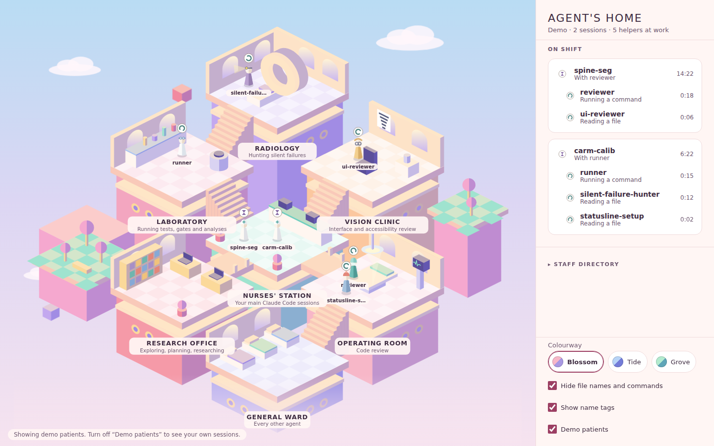
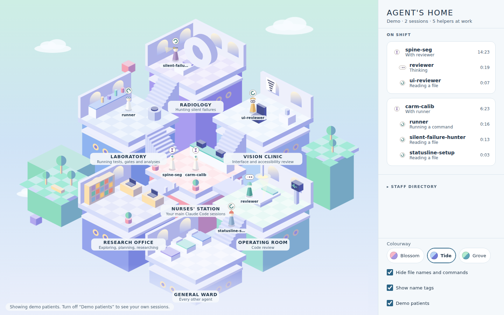
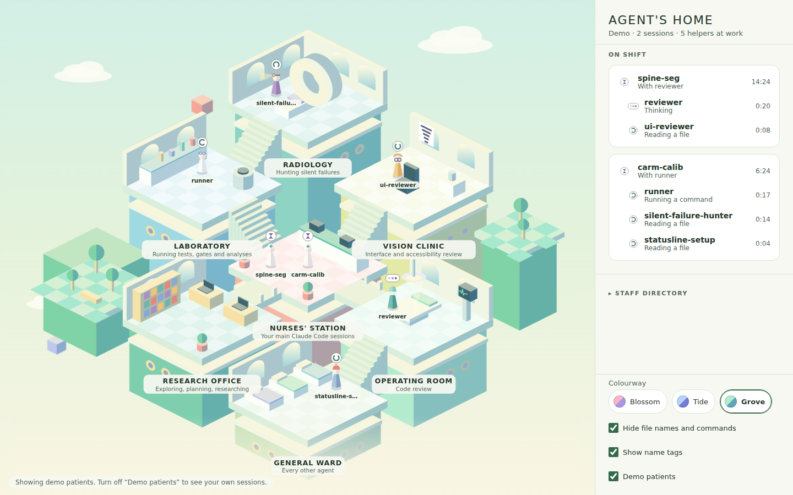

# Agent's Home

A little isometric hospital, drawn in the soft geometric style of *Monument
Valley*, where your Claude Code agents live and work. It's the same idea as
Pixel Agents, but the rooms are hospital departments:

- **Nurses' Station**: every Claude Code session you have open is an attending here.
- **Operating Room**: `reviewer` goes into surgery on your diff.
- **Research Office**: `Explore`, `Plan` and `general-purpose` do their research at the desks.
- **Laboratory**: `runner` runs tests and experiments.
- **Radiology**: `silent-failure-hunter` looks for what doesn't show on the surface.
- **Vision Clinic**: `ui-reviewer` checks contrast and legibility at the eye chart.
- **General Ward**: any other agent.

Your staff are the agents you have defined in `.claude/agents`, plus any you placed in a department. Each always stands in its own room, on **Standby** until called. When a session calls one of them, the attending walks the task over from the station and the staff member works on it in place, showing a status bubble. When it's done, it gives a little hop and goes back to standby. Agents without a post of their own (Claude's built-in Explore, Plan and general-purpose) walk in from the station as visitors and leave again when they're done.

It comes in three calm colourways inspired by *Monument Valley 3*: pastel
towers whose shaded sides turn violet, indigo or sea blue. Switch between
them at the bottom of the side panel.

| Blossom | Tide | Grove |
| --- | --- | --- |
|  |  |  |

## Install on Windows

**Download a build.** Every push builds the Windows app on GitHub Actions. Open
the repo's **Actions** tab, then the latest **Windows build** run, and download
the **AgentsHome-windows** artifact. It contains:

- `AgentsHome-Setup-<version>.exe`: installer with a Start-menu and desktop shortcut.
- `AgentsHome-Portable-<version>.exe`: a single exe that needs no install.

Tagging a version (`git tag v0.1.0 && git push --tags`) also attaches both
files to a GitHub Release.

The exe is not code-signed, so SmartScreen will warn the first time. Choose
**More info → Run anyway**.

**Or build it yourself** with Node.js 20 or later:

```powershell
git clone https://github.com/oscarwu2001/remex-agent-s-home.git
cd remex-agent-s-home
npm ci
npm start            # run it now, against your real sessions
npm run dist:win     # or build dist\AgentsHome-Setup-0.1.0.exe
```

## Getting around

- **Turn the hospital:** drag sideways with the mouse. The whole building swings round with the mouse, and when you let go it settles facing the nearest of the four directions. Q and E turn it a quarter at a time. Heights follow the view the way they do in Monument Valley: as it turns, the side coming toward you sinks, the side moving away rises, and the stairs between rooms change with them.
- **Visit a room:** click its sign or its floor. **Whole hospital** (or Esc) flies back out.
- **Zoom and move:** scroll to zoom. Right-drag (or Shift-drag) to move.
- **Settings** (the gear at the top of the panel): colourway, time of day, privacy, name tags, demo patients and the hospital layout.
- **Decorate:** visit a room and press **Decorate**. Pick its floor (checker tiles, large tiles, mosaic, wooden boards, terrazzo or plain vinyl) and put a decoration on each of its three numbered spots. Each room only offers what belongs there. The Operating Room gets a crash cart, an instrument tray, a scrub sink, an X-ray lightbox or an IV pole. The Laboratory gets a specimen fridge, a test-tube rack or an eyewash station. Radiology gets a lead apron rack. The Vision Clinic gets an eye model or a glasses display, and the Research Office a bookcase, a globe, an armchair or a whiteboard. Plants, flowers and sanitiser stands fit anywhere.
- **Plant the gardens:** click a green island and press **Plant**. You can choose tulips, daisies, lavender, a rose bush, a shrub, a small tree, a young cherry, a lamp post, stepping stones or a bench. The big tree, blossom tree, cherry blossom and fountain take 2 × 2 tiles. As you move over the plot, a see-through preview shows where the piece will stand and which tiles it covers. With **Dig up** selected, the preview shows what would go. Click to plant.
- **Wind:** every minute or two a gust blows through. The garden trees and flowers bend, and petals blow off the cherry and blossom trees and drift across the hospital (leaves, if nothing is in flower). It doesn't happen if Windows is set to reduce motion. Your choices are saved in `%APPDATA%\Agents Home\decor.json`.
- **Room style** (in Settings): **Simple** is the storybook furniture. **Detailed** furnishes every room with realistic hospital equipment, still in the same flat-colour style. That means a real operating table with padded sections and arm boards, twin surgical lights on ceiling arms, and an anaesthesia machine with gas cylinders. The ward gets hospital beds with rails, IV poles and privacy curtains. The lab gets a bench with a sink, a microscope and a fume hood. Radiology gets an MRI gantry with a patient cradle, and the Vision Clinic an exam chair with a phoropter and a slit lamp. The Nurses' Station gets a two-level counter with monitors and chairs, and departments get a navigation camera tower on wheels.
- **Weather** (in Settings): clear, cloudy, rain, snow or fog, or **Changes through the day**, which picks new weather every three hours (snow in winter, rain otherwise). Rain and snow fall over the hospital and the sun hides behind the clouds. The time, the part of the day and the weather are shown at the bottom right of the map.
- **Real weather** (in Settings, off by default): turn on **Use the real weather**, type your town and pick it from the list. The hospital then shows the weather outside, checked every 30 minutes, and the clock shows the temperature in °C or °F. This is the app's only trip online. It asks the free Open-Meteo service and sends only the place you chose. If the service can't be reached, the weather you chose by hand stands in, and the clock says so.
- **Update and restart** (Settings → Updates): if you run the app from a git clone (`npm start`), this pulls the newest code from GitHub and restarts the app. It won't pull if you have uncommitted changes in the clone. If an update changes the app's packages, it asks you to close the app and run `npm ci` instead of restarting. An installed copy is updated by running the newest setup file.
- **Time of day:** by default the hospital follows your computer's clock. Early morning (5–8) has a lavender-to-peach sky and a low rosy sun. Morning (8–11) and noon (11–14) are bright, with the sun climbing. Afternoon (14–18) turns golden, with the sun going down on the other side. Night (18–5) brings stars, a moon and lit windows. You can also pin one part of the day in Settings.
- **The attending** (your session, in the white coat) goes where its work is. It reads and searches at the Research Office bookshelf, runs commands and tests at the Laboratory bench, and edits at its desk in the station. When it hands a task to a helper, it walks the helper to the door of that helper's room. When it's your turn, it waits at the front of the counter. It only moves once the same kind of work has gone on for a few seconds.
- Helpers act out their work too: a book while reading, a pencil while writing, a bubbling flask while running commands, a magnifier while searching. They sway while thinking, hop impatiently while waiting for approval, and give a little hop of relief when they finish.

## The office team for Claude

Agent's Home can add a small, ready-made team to Claude Code, for people who
do not code. They keep prompting in Claude as usual, with their own plan, and
the team shows up in the hospital:

- **Agents:** a writer (Research Office), a summariser (Radiology), a planner (Vision Clinic), a data helper (Laboratory) and a checker (Operating Room).
- **Skills:** *Question me*, *Teach me*, *Handover note* and *Break into tasks*, adapted from `grilling`, `teach`, `handoff` and `to-tickets`.

On first start the app asks, in one short card, whether to add them. If
Claude has no agents yet, one **Add** does it. If it already has some, you
tick the ones you want. Anything already in `~/.claude` is never replaced.
**Not now** is remembered, and **Settings → Office team for Claude** keeps
the list. The files are in `office-pack/` if you'd rather copy them by hand.

## Grow the hospital

The core hospital is a 3 × 3 block. Open **Settings** (the gear), go to **Hospital layout** and choose **Add a department**. The free spots around the hospital light up with a "+" (up to 5 × 5 in all). Pick a spot, then choose **A department** or **A garden**. A garden is a new 4 × 4 plot to plant, with a name if you like. For a department, choose which one:

Spine Surgery · Neurosurgery · ENT · Dental Implantology · Maxillofacial (CMF) · Orthopaedics · Trauma · Sports Medicine · Pulmonology · Interventional Radiology · Cardiac Electrophysiology · Surgical Oncology, or **Your own department** with a name you choose.

Tick the agents who work there, or type a new agent's name. The department is built as its own tower, joined by stairs to the room next to it. It comes with a navigation suite (table, tracking camera, planning monitor) and a piece that marks its specialty. Its agents walk there when they are called. Corner spots open up once a neighbouring department exists.

Remove a department or garden from the same list. A garden takes its planting with it. The layout is saved in `%APPDATA%\Agents Home\layout.json`. Assignments written by hand in `rooms.json` still win over ones made in the app.

## Performance report

Open **Settings** (the gear), go to **Performance report**, pick a period (7, 28 or 90 days) and choose **Open report**. The report is built in the background from the same folders the app watches, WSL included, and opens in its own window. **Show the files** takes you to the saved HTML and CSV files. You can also build it from a terminal:

```powershell
npm run report                 # last 28 days
npm run report -- --days 7     # last week
```

This reads your transcripts (read-only) and writes `out/reports/agent-report-<date>.html`, a self-contained page that opens offline. It also writes `runs`, `daily` and `weekly` CSV files for your own analysis. The page shows:

- **Headline numbers:** helper runs, the share that finished, median helper time and tokens used, each compared with the period before.
- **Scorecard per agent:** runs, a score out of 100, finished %, re-runs, median and p90 time, tokens per run, tool calls per run, tool error rate, PASS/FAIL or Approve/Block verdicts, and a 14-day sparkline.
- **Charts:** runs per day, weekly score per agent, and how long each agent takes.

The **score** is reliability (40), right first time (20), speed (20) and efficiency (20). Speed and efficiency are measured against the same agent's own history, never against other agents. A reviewer answering FAIL is doing its job and is never marked down for it. The report keeps no prompts, results, file names or commands. Sessions appear as `s1`, `s2`…, and project names appear only if you ask with `--by-project`.

## How it works

Claude Code writes every conversation to a JSONL transcript under
`%USERPROFILE%\.claude\projects\` (or `$CLAUDE_CONFIG_DIR\projects`). Sessions
run inside WSL write to the Linux home instead; the app finds those by itself
as `\\wsl.localhost\<distro>\home\<user>\.claude\projects` for every distro
that is running (it never starts a stopped one). The app polls those folders,
tails files written in the last 30 minutes, and turns each
line into events: a tool call starts, a tool returns, a `Task`/`Agent` call
spawns a helper, the answer ends. From those events it decides what each
figure is doing:

| Bubble | Board says | Meaning |
| --- | --- | --- |
| spinner | *Reading a file*, *Running a command*… | working |
| three dots | Thinking | waiting on the model |
| sheet of notes | Writing up findings | a helper is writing its report |
| red **?** | Needs approval, or a long tool is running | a Bash/Edit/Write/Web call has been pending for 7 s. The app can't tell which of the two it is, so it says both |
| hourglass | With *reviewer* | the session is waiting on a helper |
| speech bubble | Your turn | the session has finished its answer |
| tick | Finished | a helper returned and is walking home |
| dashed tick | Presumed finished | a background helper went quiet for 2 minutes |
| red diamond | Failed | a helper returned an error |
| dark square | Stopped | a helper was interrupted |

Each row also shows **tokens used**, counted the same way as the performance report (input, output and cache, each reply once). A session's row includes every helper it has called. The header shows the total for everyone on shift.

Click a figure or a row on the board to open its **chart**, which shows its
recent tool calls and its tokens split into input, output, cache read and cache write.

**Privacy.** The app is local only. It makes no network requests and never
writes to `.claude`. There are two exceptions, and both happen only when you ask:
- **Use the real weather**, switched on in Settings, asks
  [Open-Meteo](https://open-meteo.com) for the weather and temperature every
  30 minutes. It sends only the place you chose, never anything from your
  sessions.
- **Update and restart** pulls the newest code with git. **Hide file names and commands** is on by default. With
it on, the board shows "Reading a file" but not the file's name, and it hides
task descriptions and folder paths too. Error messages never quote the
contents of a transcript line. Turn privacy off when you're not sharing your
screen.

**Your own agents.** Agents in `~/.claude/agents/*.md` and in each open
project's `.claude/agents/` are listed in the **Staff directory** with the room
they'll use. To move an agent, create `rooms.json` in the app's data folder
(`%APPDATA%\Agents Home\rooms.json`):

```json
{ "my-security-auditor": "operating-room", "doc-writer": "research-office" }
```

Room ids are `nurses-station`, `operating-room`, `research-office`,
`laboratory`, `radiology`, `vision-clinic` and `general-ward`. A typo is
reported under **Needs attention**, not silently ignored.

## Develop

```bash
npm ci
npm test          # fast unit tests for the parser, tracker, rooms and tailer
npm run demo      # the app with scripted demo patients
npm run preview   # the renderer in a browser: http://localhost:5178/?demo=1
```

`CLAUDE.md` has the rules for this repo. `CONTEXT.md` has the vocabulary.
`.claude/agents/` holds the `reviewer`, `runner`, `silent-failure-hunter` and
`ui-reviewer` agents, and `.claude/skills/project-quality/` holds the
reviewer's checklist for this project.

## Credits

The idea comes from [Pixel Agents](https://github.com/pablodelucca/pixel-agents).
The art style is a homage to *Monument Valley* by ustwo games. All artwork here
is original and drawn in code; no assets from the game are used.

MIT licence.
