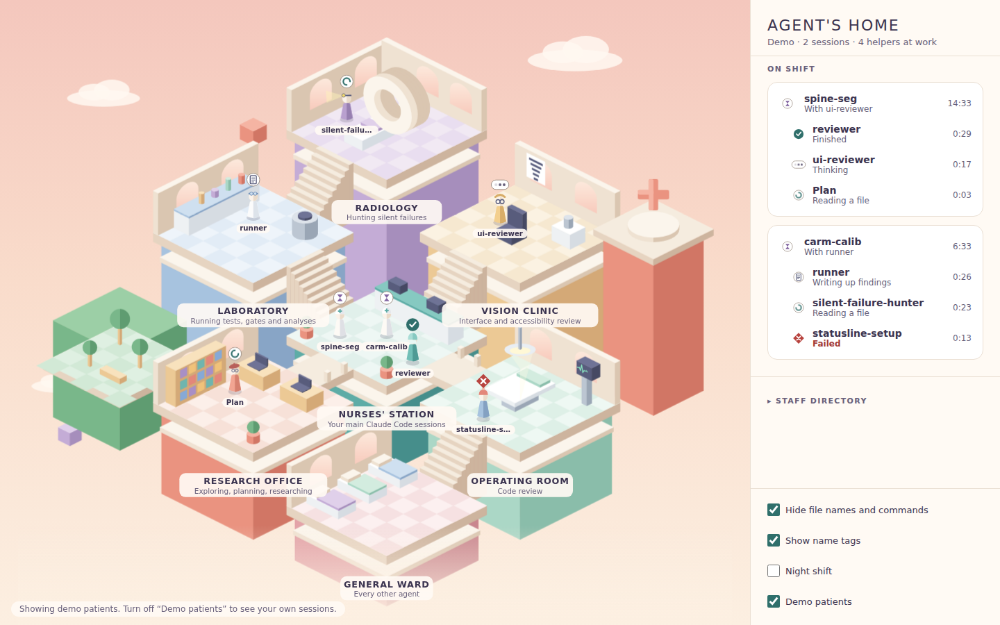
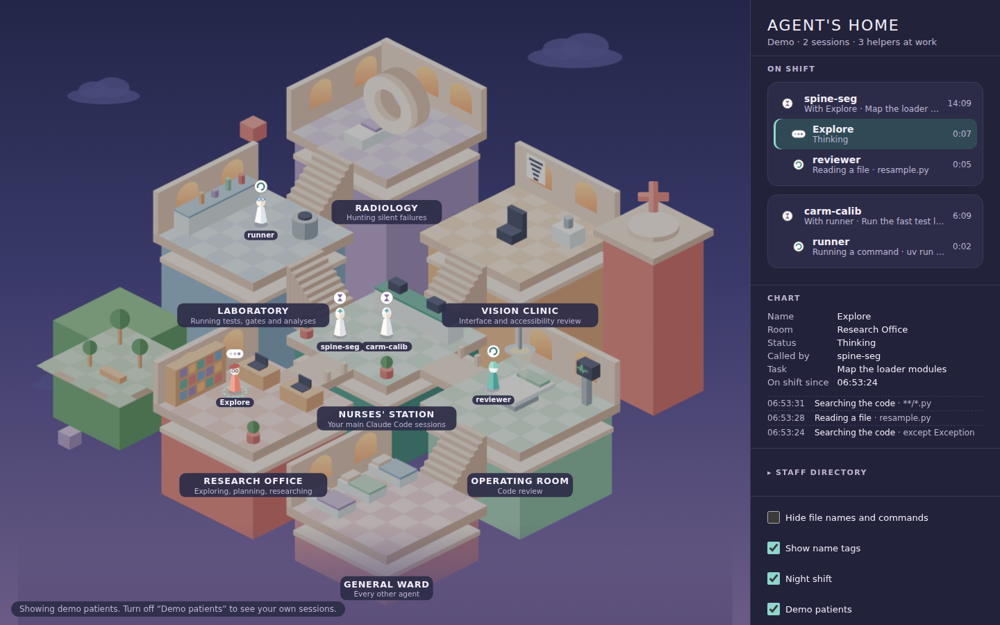

# Agent's Home

A little isometric hospital, drawn in the soft geometric style of *Monument
Valley*, where your Claude Code agents live and work. It's the same idea as
Pixel Agents, but the rooms are hospital departments:

- **Nurses' Station**: every Claude Code session you have open is an attending here.
- **Operating Room**: `reviewer` goes into surgery on your diff.
- **Research Office**: `Explore`, `Plan` and `general-purpose` do their research at the desks.
- **Laboratory**: `runner` runs tests and experiments.
- **Radiology**: `silent-failure-hunter` looks for what doesn't show on the surface.
- **Vision Clinic**: `ui-reviewer` checks contrast and legibility at the eye chart.
- **General Ward**: any other agent.

When a session calls a sub-agent, a figure walks out of the station, along the
bridges and up the stairs to its room. It works there, showing a status bubble,
and walks back when it returns its result.





## Install on Windows

**Download a build.** Every push builds the Windows app on GitHub Actions. Open
the repo's **Actions** tab, then the latest **Windows build** run, and download
the **AgentsHome-windows** artifact. It contains:

- `AgentsHome-Setup-<version>.exe`: installer with a Start-menu and desktop shortcut.
- `AgentsHome-Portable-<version>.exe`: a single exe that needs no install.

Tagging a version (`git tag v0.1.0 && git push --tags`) also attaches both
files to a GitHub Release.

The exe is not code-signed, so SmartScreen will warn the first time. Choose
**More info → Run anyway**.

**Or build it yourself** with Node.js 20 or later:

```powershell
git clone https://github.com/oscarwu2001/remex-agent-s-home.git
cd remex-agent-s-home
npm ci
npm start            # run it now, against your real sessions
npm run dist:win     # or build dist\AgentsHome-Setup-0.1.0.exe
```

## How it works

Claude Code writes every conversation to a JSONL transcript under
`%USERPROFILE%\.claude\projects\` (or `$CLAUDE_CONFIG_DIR\projects`). The app
polls that folder, tails files written in the last 30 minutes, and turns each
line into events: a tool call starts, a tool returns, a `Task`/`Agent` call
spawns a helper, the answer ends. From those events it decides what each
figure is doing:

| Bubble | Board says | Meaning |
| --- | --- | --- |
| spinner | *Reading a file*, *Running a command*… | working |
| three dots | Thinking | waiting on the model |
| sheet of notes | Writing up findings | a helper is writing its report |
| red **?** | Needs approval, or a long tool is running | a Bash/Edit/Write/Web call has been pending for 7 s. The app can't tell which of the two it is, so it says both |
| hourglass | With *reviewer* | the session is waiting on a helper |
| speech bubble | Your turn | the session has finished its answer |
| tick | Finished | a helper returned and is walking home |
| dashed tick | Presumed finished | a background helper went quiet for 2 minutes |
| red diamond | Failed | a helper returned an error |
| dark square | Stopped | a helper was interrupted |

Click a figure or a row on the board to open its **chart**, which shows its
recent tool calls.

**Privacy.** The app is local only. It makes no network requests and never
writes to `.claude`. **Hide file names and commands** is on by default. With
it on, the board shows "Reading a file" but not the file's name, and it hides
task descriptions and folder paths too. Error messages never quote the
contents of a transcript line. Turn privacy off when you're not sharing your
screen.

**Your own agents.** Agents in `~/.claude/agents/*.md` and in each open
project's `.claude/agents/` are listed in the **Staff directory** with the room
they'll use. To move an agent, create `rooms.json` in the app's data folder
(`%APPDATA%\Agents Home\rooms.json`):

```json
{ "my-security-auditor": "operating-room", "doc-writer": "research-office" }
```

Room ids are `nurses-station`, `operating-room`, `research-office`,
`laboratory`, `radiology`, `vision-clinic` and `general-ward`. A typo is
reported under **Needs attention**, not silently ignored.

## Develop

```bash
npm ci
npm test          # fast unit tests for the parser, tracker, rooms and tailer
npm run demo      # the app with scripted demo patients
npm run preview   # the renderer in a browser: http://localhost:5178/?demo=1
```

`CLAUDE.md` has the rules for this repo. `CONTEXT.md` has the vocabulary.
`.claude/agents/` holds the `reviewer`, `runner`, `silent-failure-hunter` and
`ui-reviewer` agents, and `.claude/skills/project-quality/` holds the
reviewer's checklist for this project.

## Credits

The idea comes from [Pixel Agents](https://github.com/pablodelucca/pixel-agents).
The art style is a homage to *Monument Valley* by ustwo games. All artwork here
is original and drawn in code; no assets from the game are used.

MIT licence.
