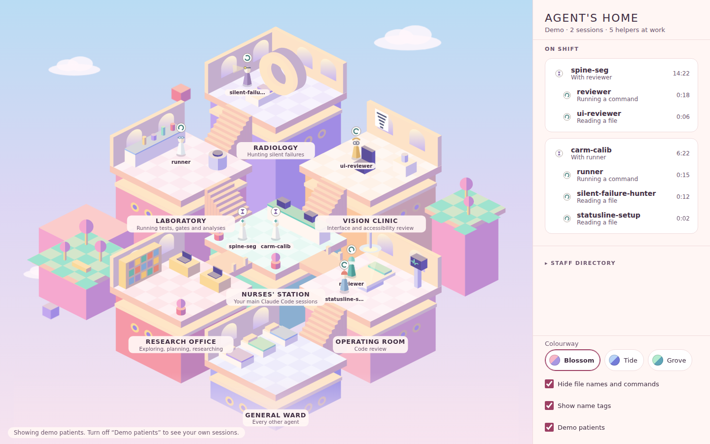
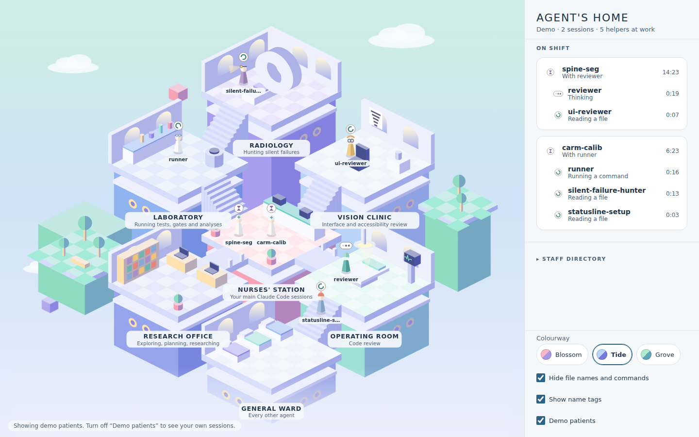
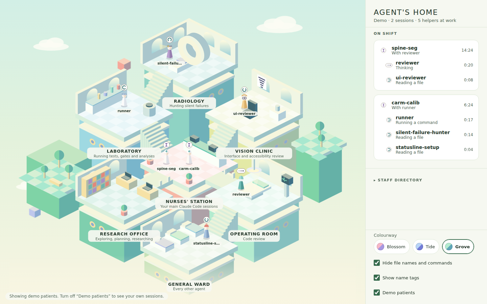

# Agent's Home

A little isometric hospital, drawn in the soft geometric style of *Monument
Valley*, where your Claude Code agents live and work. It's the same idea as
Pixel Agents, but the rooms are hospital departments:

- **Nurses' Station**: every Claude Code session you have open is an attending here.
- **Operating Room**: `reviewer` goes into surgery on your diff.
- **Research Office**: `Explore`, `Plan` and `general-purpose` do their research at the desks.
- **Laboratory**: `runner` runs tests and experiments.
- **Radiology**: `silent-failure-hunter` looks for what doesn't show on the surface.
- **Vision Clinic**: `ui-reviewer` checks contrast and legibility at the eye chart.
- **General Ward**: any other agent.

Your staff are the agents you have defined in `.claude/agents`, plus any you placed in a department. Each always stands in its own room, on **Standby** until called. When a session calls one of them, the attending walks the task over from the station and the staff member works on it in place, showing a status bubble. When it's done, it gives a little hop and goes back to standby. Agents without a post of their own (Claude's built-in Explore, Plan and general-purpose) walk in from the station as visitors and leave again when they're done.

It comes in three calm colourways inspired by *Monument Valley 3*: pastel
towers whose shaded sides turn violet, indigo or sea blue. Switch between
them at the bottom of the side panel.

| Blossom | Tide | Grove |
| --- | --- | --- |
|  |  |  |

## Install on Windows

**Download a build.** Every push builds the Windows app on GitHub Actions. Open
the repo's **Actions** tab, then the latest **Windows build** run, and download
the **AgentsHome-windows** artifact. It contains:

- `AgentsHome-Setup-<version>.exe`: installer with a Start-menu and desktop shortcut.
- `AgentsHome-Portable-<version>.exe`: a single exe that needs no install.

Tagging a version (`git tag v0.1.0 && git push --tags`) also attaches both
files to a GitHub Release.

The exe is not code-signed, so SmartScreen will warn the first time. Choose
**More info → Run anyway**.

**Or build it yourself** with Node.js 20 or later:

```powershell
git clone https://github.com/oscarwu2001/remex-agent-s-home.git
cd remex-agent-s-home
npm ci
npm start            # run it now, against your real sessions
npm run dist:win     # or build dist\AgentsHome-Setup-0.1.0.exe
```

## Getting around

- **Turn the hospital:** drag sideways with the mouse. The whole building swings round with the mouse, and when you let go it settles facing the nearest of the four directions. Q and E turn it a quarter at a time. Heights follow the view the way they do in Monument Valley: as it turns, the side coming toward you sinks, the side moving away rises, and the stairs between rooms change with them.
- **Visit a room:** click its sign or its floor. **Whole hospital** (or Esc) flies back out.
- **Zoom and move:** scroll to zoom. Right-drag (or Shift-drag) to move.
- **Settings** (the gear at the top of the panel): colourway, time of day, privacy, name tags, demo patients and the hospital layout.
- **Decorate:** visit a room and press **Decorate**. Every room is a 6 × 6 grid of tiles, and everything in it is an item you can move: the operating table, the beds, the MRI scanner, the counter, desks and shelves, plus decorations and some fun extras (sofa, rug, fish tank, vending machine, floor lamp and more). Pick an item from the pictures and point at the floor to see it there before you click. **Move** picks up an item so you can put it somewhere else. **Remove** takes it away. Long pieces can be turned. Any item fits in any room, and the ones that belong there are listed first. Doorways stay clear. **Back to how it was** restores the room's own furniture. The floor has six patterns, each shown as a swatch.
- **Plant the gardens:** click a green island and press **Plant**. You can choose tulips, daisies, lavender, a rose bush, a shrub, a small tree, a young cherry, a lamp post, stepping stones or a bench. The big tree, blossom tree, cherry blossom and fountain take 2 × 2 tiles. As you move over the plot, a see-through preview shows where the piece will stand and which tiles it covers. With **Dig up** selected, the preview shows what would go. Click to plant.
- **Wind:** every minute or two a gust blows through. The garden trees and flowers bend, and petals blow off the cherry and blossom trees and drift across the hospital (leaves, if nothing is in flower). It doesn't happen if Windows is set to reduce motion. Your choices are saved in `%APPDATA%\Agents Home\decor.json`.
- **Room style** (in Settings): **Simple** is the storybook furniture. **Detailed** furnishes every room with realistic hospital equipment, still in the same flat-colour style. That means a real operating table with padded sections and arm boards, twin surgical lights on ceiling arms, and an anaesthesia machine with gas cylinders. The ward gets hospital beds with rails, IV poles and privacy curtains. The lab gets a bench with a sink, a microscope and a fume hood. Radiology gets an MRI gantry with a patient cradle, and the Vision Clinic an exam chair with a phoropter and a slit lamp. The Nurses' Station gets a two-level counter with monitors and chairs, and departments get a navigation camera tower on wheels.
- **Weather** (in Settings): clear, cloudy, rain, snow or fog, or **Changes through the day**, which picks new weather every three hours (snow in winter, rain otherwise). Rain and snow fall over the hospital and the sun hides behind the clouds. The time, the part of the day and the weather are shown at the bottom right of the map.
- **Real weather** (in Settings, off by default): turn on **Use the real weather**, type your town and pick it from the list. The hospital then shows the weather outside, checked every 30 minutes, and the clock shows the temperature in °C or °F. This is the app's only trip online. It asks the free Open-Meteo service and sends only the place you chose. If the service can't be reached, the weather you chose by hand stands in, and the clock says so.
- **Update and restart** (Settings → Updates): if you run the app from a git clone (`npm start`), this pulls the newest code from GitHub and restarts the app. It won't pull if you have uncommitted changes in the clone. If an update changes the app's packages, it asks you to close the app and run `npm ci` instead of restarting. An installed copy is updated by running the newest setup file.
- **Time of day:** by default the hospital follows your computer's clock. Early morning (5–8) has a lavender-to-peach sky and a low rosy sun. Morning (8–11) and noon (11–14) are bright, with the sun climbing. Afternoon (14–18) turns golden, with the sun going down on the other side. Night (18–5) brings stars, a moon and lit windows. You can also pin one part of the day in Settings.
- **The attending** (your session, in the white coat) goes where its work is. It reads and searches at the Research Office bookshelf, runs commands and tests at the Laboratory bench, and edits at its desk in the station. When it hands a task to a helper, it walks the helper to the door of that helper's room. When it's your turn, it waits at the front of the counter. It only moves once the same kind of work has gone on for a few seconds.
- Helpers act out their work too: a book while reading, a pencil while writing, a bubbling flask while running commands, a magnifier while searching. They sway while thinking, hop impatiently while waiting for approval, and give a little hop of relief when they finish.

## The Meadow

The Meadow is a hidden extra. A normal start shows a **Report** button at the
top of the map instead, which builds the performance report and opens it
straight away. To turn the Meadow on, start the app with `--meadow`:
`npm run meadow` (or `npm start -- --meadow`); for the installed app, add
` --meadow` to the end of the shortcut's Target, or set the environment
variable `AGENTS_HOME_MEADOW=1`. In the browser preview, add `&meadow=1`.

With it on, press **Meadow** at the top of the map for a second screen, away from the
hospital: a floating island of nine grass terraces at different heights,
drawn in the same Monument Valley isometric 3D as the hospital. Every agent
lives there: the agents in your `.claude/agents`, plus every agent Claude
has ever called (built-in ones like Explore included). Once an agent has
been seen it keeps its spot, even after months of quiet.

Every agent grows up like a Pokémon:

- **Egg.** Each agent starts as an egg in a straw nest. It cracks as the
  agent works, and once the agent has used 100k tokens it is ready to hatch.
- **Hatching.** Pick one of three starters (always the same three for that
  agent) from ten kinds: cat, dog, bunny, fox, dragon, dinosaur, fish, bird,
  turtle and axolotl. It hatches as a baby.
- **Growing and evolving.** It grows as the agent uses more tokens. At 1M
  tokens it can evolve, and again at 5M. Each evolution starts small again,
  and each kind has three stages (for example Drakelet, Drake, Skywyrm).
  Fully grown dragons and birds fly.
- **Rarity.** Every creature starts R. Good work earns it SR (a score of 80
  over 5 or more runs) or SSR (90 over 10 or more), shown with gold or
  rainbow sparkles and stars by its name. Once earned, rarity is kept.
- **Looks.** Each kind has ten looks to choose from.
- **SR and SSR show.** An SR creature wears silver anklets and a
  silver-set gem. An SSR one turns gold: gold markings and trim, gold
  anklets, a ruby in a gold setting, a floating gold halo and a gold glow.
- **Points and mystery eggs.** Every 15 minutes the app is open earns a
  point (time asleep does not count), and you start with 8. A mystery egg
  costs 8 points and hatches after an hour of the app running, into a
  random creature: any kind and look, rare (SR) 1 time in 5, super rare
  (SSR) 1 in 20. Mystery creatures belong to no agent. They grow and evolve
  with time in the app (hatch after 1 hour, evolve at 10 and 50 hours).
  The island has room for 12.
- **Creature index.** Every form you have raised (10 kinds × 3 stages),
  its best rarity and the looks you have seen. Forms not found yet show as
  shadows.

Tokens are counted per agent per day and kept, so growth never goes
backwards. The creatures wander about like mobs in a block game: they walk
tile by tile, hop up and down the terraces, rest, and set off again. The
fish swim in the pond. They stand still if your system asks for reduced
motion.

Click a creature, or its name in the sidebar, to see how it is growing and
its performance: score, runs, finished rate, re-runs, median time, tokens,
tool errors, verdicts and runs per day (the performance report's numbers
for the last 28 days). Q and E (or dragging) turn the island. The demo shows
every stage without saving anything.

## The office team for Claude

Agent's Home can add a small, ready-made team to Claude Code, for people who
do not code and for people who do. They keep prompting in Claude as usual,
with their own plan, and the team shows up in the hospital:

- **Agents for office work:** a writer (Research Office), a summariser (Radiology), a planner (Vision Clinic), a data helper (Laboratory) and a checker (Operating Room).
- **Agents for coding:** a code reviewer (Operating Room) that checks a change before it is called done, and a test runner (Laboratory) that runs tests and builds and reports only what matters.
- **Skills:** *Question me*, *Teach me*, *Handover note* and *Break into tasks*, adapted from `grilling`, `teach`, `handoff` and `to-tickets`.
- **Team reminders (a hook):** Claude only calls an agent when it thinks one fits, and it often doesn't think of it. With reminders on, a request that fits one of the team gets a one-line reminder added to it ("After you change code, give the change to the code-reviewer agent…"). It mentions only agents that are installed. When nothing fits it adds nothing, so it costs no tokens. It reads the prompt and keeps nothing. Turning it on adds one entry to `~/.claude/settings.json`, and changes nothing else there. The app first keeps a copy as `settings.json.agents-home-backup`, and leaves a file it cannot read as JSON alone.

How work flows through the team is drawn in
[`office-pack/PIPELINE.md`](office-pack/PIPELINE.md).

On first start the app asks, in one short card, whether to add them. If
Claude has no agents yet, one **Add** does it. If it already has some, you
tick the ones you want. Anything already in `~/.claude` is never replaced.
**Not now** is remembered, and **Settings → Office team for Claude** keeps
the list. The files are in `office-pack/` if you'd rather copy them by hand.

**Settings → Updates → Update agents** brings the team up to date in one go.
It adds any helpers not there yet and turns on the reminders. It also refreshes
files that are exactly as some earlier version of the app shipped them. A file
you edited is left as it is, and listed. Press **Update and restart** first to
get the newest team, then **Update agents**, then start a new Claude session.

## Grow the hospital

The core hospital is a 3 × 3 block. Open **Settings** (the gear), go to **Hospital layout** and choose **Add a department**. The free spots around the hospital light up with a "+" (up to 5 × 5 in all). Pick a spot, then choose **A department** or **A garden**. A garden is a new 4 × 4 plot to plant, with a name if you like. For a department, choose which one:

Spine Surgery · Neurosurgery · ENT · Dental Implantology · Maxillofacial (CMF) · Orthopaedics · Trauma · Sports Medicine · Pulmonology · Interventional Radiology · Cardiac Electrophysiology · Surgical Oncology, or **Your own department** with a name you choose.

Tick the agents who work there, or type a new agent's name. The department is built as its own tower, joined by stairs to the room next to it. It comes with a navigation suite (table, tracking camera, planning monitor) and a piece that marks its specialty. Its agents walk there when they are called. Corner spots open up once a neighbouring department exists.

**Move an agent to another room:** press on an idle agent standing at its post, drag it onto another room and let go. The room lights up as you pass over it, and the agent walks over and works there from now on. You can also click the agent and use **Work in another room** in its chart, which works with the keyboard. Busy agents finish where they are first. The move is saved with the layout. An agent that `rooms.json` places stays where that file says, because `rooms.json` always wins.

Remove a department or garden from the same list. A garden takes its planting with it. The layout is saved in `%APPDATA%\Agents Home\layout.json`. Assignments written by hand in `rooms.json` still win over ones made in the app.

## Live map

Click a session (or any of its helpers) under **On shift** and a **live map** of that session pops up beside the hospital. The session is at the top; below it, in order, is everything it has called: the skills it ran and every helper, finished ones included, each with the skills it ran itself. Whatever is running right now pulses and says **Running now** with what it is doing; finished helpers show how they finished (finished, failed, stopped), their time and tokens. A line at the top counts what is running, finished, failed and the skills used. It updates as the session works. Click the same row again, press Esc, or use the close button to hide it. Like the board, file names and commands appear only with privacy mode off; skill names and agent types always show.

## System log

For checking the team is working, and for debugging. The app keeps two plain-text logs in its data folder (`%APPDATA%\Agents Home\logs`), never under `~/.claude`:

- **activity.log:** app start (version, whether the reminders are on, how much of the team is in Claude), each session starting and going quiet, each helper starting (agent, session, room) and finishing (how it finished, time, tokens), skills used and by whom, a summary every 5 minutes of who is working, and team changes (installs, Update agents).
- **errors.log:** everything that appears under **Needs attention**, crashes in the app, and errors in its window.

Each line reads `2026-09-30 14:03:12  helper-end     agent=reviewer session=spine-seg outcome=finished time=48s tokens=38211`. A log over 2 MB moves aside to `activity.1.log` and starts again. It keeps names, rooms, statuses, times and token counts only: never prompts, task descriptions, file names or commands. errors.log can name a folder that could not be read.

**Settings → System log** shows the newest lines of either log, opens the folder, and says whether the **team reminders** are running. The reminder hook keeps its own short log (`~/.claude/hooks/agents-home-router.log`: time and which reminders fired, never the prompt). From that the app shows, for example: "Team reminders are working: in the last 24 hours they ran on 42 prompts and reminded Claude on 17."

## Performance report

Press **Report** at the top of the map to build it for the chosen period and open it straight away. Or open **Settings** (the gear), go to **Performance report**, pick a period (7, 28 or 90 days) and choose **Open report**. The report is built in the background from the same folders the app watches, WSL included, and opens in its own window. **Show the files** takes you to the saved HTML and CSV files. You can also build it from a terminal:

```powershell
npm run report                                         # last 28 days
npm run report -- --days 7                             # last week
npm run report -- --since 2026-09-01 --until 2026-09-30
npm run report -- --compare 2026-09-24                 # before / after a change
npm run report -- --details                            # show Agent-call descriptions
```

This reads your transcripts (read-only) and writes `out/reports/agent-report-<date>.html`, a self-contained page that opens offline. It also writes `runs`, `daily` and `weekly` CSV files for your own analysis. The page shows:

- **Headline numbers:** helper runs, the share that finished, median helper time and tokens used, each compared with the period before.
- **Scorecard per agent:** runs, a score out of 100, finished %, re-runs, median and p90 time, tokens per run, tool calls per run, tool error rate, PASS/FAIL or Approve/Block verdicts, and a 14-day sparkline.
- **Charts:** runs per day, weekly score per agent, and how long each agent takes.
- **Machine and config:** the hostname, the git commit of each `.claude` folder read, and the enabled plugins, so reports from two laptops can be told apart.
- **Where general-purpose goes:** general-purpose runs grouped by **caller**, meaning the skill running the parent's turn when the helper was launched (`/grilling`, `/code-review`…) or "direct". Each caller gets runs, tokens, share, weighted cost, and median and p90 time. A **could have been typed** table flags runs whose tool mix (70% or more of the working tools) looks like `Explore` (Read/Grep/Glob, no edits), `researcher` (WebFetch/WebSearch) or `runner` (Bash, no edits), with their share of general-purpose tokens. It also lists the 10 most expensive runs with caller, mode, model, tokens and time.
- **Tokens by type:** fresh input, cache write, cache read and output per agent, plus a **weighted** column in fresh-input-token equivalents (input × 1, cache write × 1.25, cache read × 0.1, output × 5), so cache re-reads don't look like fresh spending. Helper transcripts that match no call are an **unattributed** row with their tokens. A line accounts for every helper transcript: how many were matched by agent id, by prompt, or left unattributed.
- **Foreground and background times:** each run is labelled. A background run is timed from its launch to the helper's last transcript line or its completion notice, not to the launch's immediate "Async agent launched" return. Runs with no recorded end are counted apart and left out of the times. Weeks that mix the two kinds aren't scored.
- **Skills loaded inside helpers:** loads per agent and skill, with the SKILL.md size of each load, split before and after `--compare`.
- **Where skills come from:** local, plugin or project, with names matched without their plugin prefix (`mattpocock-skills:tdd` is `tdd`). A skill installed from two places (an enabled plugin and your own folder, say) is flagged as a duplicate.
- **Before and after** (with `--compare`): runs, weighted tokens, median time and skill loads per agent on each side of the date.
- **How your team works together:** a flow from you to the agents and skills you (or Claude for you) called, and on to the skills those agents ran, with the number of calls on every line. It also lists the usual hand-off chains within a session (for example `/implement → /tdd → reviewer (FAIL) → reviewer (PASS)`), a table of skills (typed by you, picked by Claude, run inside an agent, error rate), and the agents and skills that are installed but were not used in the period. It is built only from what the transcripts show happened, not from anyone's routing rules, so it fits any set-up. It reads skill names only, never their arguments. It also reads the names in the `agents` and `skills` folders beside each `projects` folder.

The **score** is reliability (40), right first time (20), speed (20) and efficiency (20). Speed and efficiency are measured against the same agent's own history, never against other agents. A reviewer answering FAIL is doing its job and is never marked down for it. The report keeps no results, file names or commands. An Agent call's description and the first line of its prompt appear only with `--details`; from the app, only when privacy mode is off. `runs.csv` also gets each run's mode, caller, model, tool counts, skill loads, all four token types, weighted cost and could-be flag. Sessions appear as `s1`, `s2`…, and project names appear only if you ask with `--by-project`.

## How it works

Claude Code writes every conversation to a JSONL transcript under
`%USERPROFILE%\.claude\projects\` (or `$CLAUDE_CONFIG_DIR\projects`). Sessions
run inside WSL write to the Linux home instead; the app finds those by itself
as `\\wsl.localhost\<distro>\home\<user>\.claude\projects` for every distro
that is running (it never starts a stopped one). The app polls those folders,
tails files written in the last 30 minutes, and turns each
line into events: a tool call starts, a tool returns, a `Task`/`Agent` call
spawns a helper, the answer ends. From those events it decides what each
figure is doing:

| Bubble | Board says | Meaning |
| --- | --- | --- |
| spinner | *Reading a file*, *Running a command*… | working |
| three dots | Thinking | waiting on the model |
| sheet of notes | Writing up findings | a helper is writing its report |
| red **?** | Needs approval, or a long tool is running | a Bash/Edit/Write/Web call has been pending for 7 s. The app can't tell which of the two it is, so it says both |
| hourglass | With *reviewer* | the session is waiting on a helper |
| speech bubble | Your turn | the session has finished its answer |
| tick | Finished | a helper returned and is walking home |
| dashed tick | Presumed finished | a background helper went quiet for 2 minutes |
| red diamond | Failed | a helper returned an error |
| dark square | Stopped | a helper was interrupted |

**Claude Code use.** A card at the top of the board shows the tokens all your Claude Code sessions used in the last 5 hours, today and the last 7 days, with and without cache reads. Each session row also shows how full its context is.

**Save-your-work warnings.** The app warns you, on the board and as a Windows notification (switch it off in **Settings → Usage warnings**), when:
- a session has used 85% of its context. The limit is where that model was seen to auto-compact, or otherwise the model's context window.
- Claude Code itself says a usage limit is near or reached.
- your own warning level is reached. Set how many tokens in 5 hours in Settings; you get a warning at 80% and again at 100%.

Plan limits (Pro, Max) are not written anywhere on your computer, so the app doesn't guess them.

Each row also shows **tokens used**, counted the same way as the performance report (input, output and cache, each reply once). A session's row includes every helper it has called. The header shows the total for everyone on shift.

Click a figure or a row on the board to open its **chart**, which shows its
recent tool calls and its tokens split into input, output, cache read and cache write.

**Privacy.** The app is local only. It makes no network requests and never
writes to `.claude`. There are two exceptions, and both happen only when you ask:
- **Use the real weather**, switched on in Settings, asks
  [Open-Meteo](https://open-meteo.com) for the weather and temperature every
  30 minutes. It sends only the place you chose, never anything from your
  sessions.
- **Update and restart** pulls the newest code with git. **Hide file names and commands** is on by default. With
it on, the board shows "Reading a file" but not the file's name, and it hides
task descriptions and folder paths too. Error messages never quote the
contents of a transcript line. Turn privacy off when you're not sharing your
screen.

**Your own agents.** Agents in `~/.claude/agents/*.md` and in each open
project's `.claude/agents/` are listed in the **Staff directory** with the room
they'll use. To move an agent, create `rooms.json` in the app's data folder
(`%APPDATA%\Agents Home\rooms.json`):

```json
{ "my-security-auditor": "operating-room", "doc-writer": "research-office" }
```

Room ids are `nurses-station`, `operating-room`, `research-office`,
`laboratory`, `radiology`, `vision-clinic` and `general-ward`. A typo is
reported under **Needs attention**, not silently ignored.

## Develop

```bash
npm ci
npm test          # fast unit tests for the parser, tracker, rooms and tailer
npm run demo      # the app with scripted demo patients
npm run preview   # the renderer in a browser: http://localhost:5178/?demo=1
```

`CLAUDE.md` has the rules for this repo. `CONTEXT.md` has the vocabulary.
`.claude/agents/` holds the `reviewer`, `runner`, `silent-failure-hunter` and
`ui-reviewer` agents, and `.claude/skills/project-quality/` holds the
reviewer's checklist for this project.

## Credits

The idea comes from [Pixel Agents](https://github.com/pablodelucca/pixel-agents).
The art style is a homage to *Monument Valley* by ustwo games. All artwork here
is original and drawn in code; no assets from the game are used.

MIT licence.
