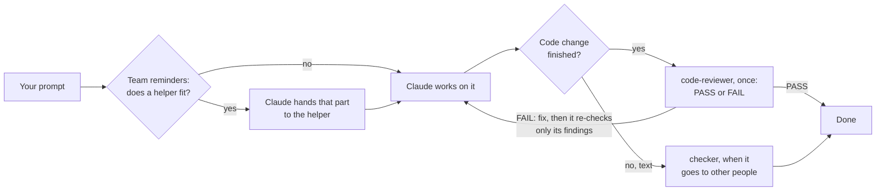

# The team pipeline

How work flows through the Office pack's team in Claude Code. The team
reminders hook (`hooks/agents-home-router.sh`) is what steers it.

## One helper when one fits

Claude does the work itself and hands a part over when a helper
fits it, one at a time.

| Request | Helper |
| --- | --- |
| an email, letter, reply, rewrite | `writer` |
| a summary, key points, action items | `summariser` |
| a plan, schedule, checklist | `planner` |
| tables, numbers, formulas | `data-helper` |
| a second look before it goes out | `checker` |
| a finished code change (feature, bug, refactor) | `code-reviewer`, once per change, not after each small fix |
| running tests, a build or a linter | `test-runner`: the tests for the change first, the full suite only when needed |

## Worth knowing

- Claude picks helpers by their descriptions; the reminders only make it
  think of them. Nothing is forced.
- Each helper keeps its own rules: keep it simple but useful, plain words,
  never invent facts, never repeat patient identifiers.
- The reminders read the prompt and keep nothing; with nothing to remind,
  they add nothing.
