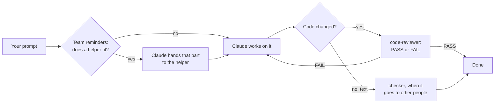
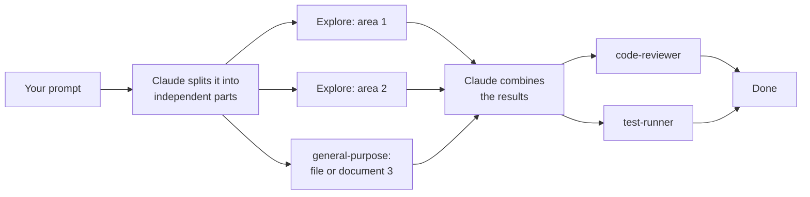

# The team pipeline

How work flows through the Office pack's team in Claude Code, in its two
speeds. The team reminders hook (`hooks/agents-home-router.sh`) is what steers
it; the speed is chosen in Agent's Home under **Settings → Office team for
Claude → Team speed** and kept in `~/.claude/hooks/agents-home-mode`.

## Base: one helper when one fits

Fewer tokens. Claude does the work itself and hands a part over when a helper
fits it, one at a time.

| Request | Helper |
| --- | --- |
| an email, letter, reply, rewrite | `writer` |
| a summary, key points, action items | `summariser` |
| a plan, schedule, checklist | `planner` |
| tables, numbers, formulas | `data-helper` |
| a second look before it goes out | `checker` |
| a code change (fix, feature, refactor) | `code-reviewer` after the change |
| tests, builds, long commands | `test-runner` |

## Fast: several helpers at the same time

Uses more tokens and finishes sooner. On top of Base, any real task (eight
words or more) gets one more reminder: split independent parts across several
helpers started together, several Task calls in one reply, then combine what
they return.

Parts that need another part's result still wait for it. Good fits for Fast:
searching several areas of a codebase, reviewing and testing at once,
summarising several documents, drafting several separate emails.

## What stays the same in both

- Claude picks helpers by their descriptions; the reminders only make it
  think of them. Nothing is forced.
- Each helper keeps its own rules: keep it simple but useful, plain words,
  never invent facts, never repeat patient identifiers.
- The reminders read the prompt and keep nothing; with nothing to remind,
  they add nothing.
